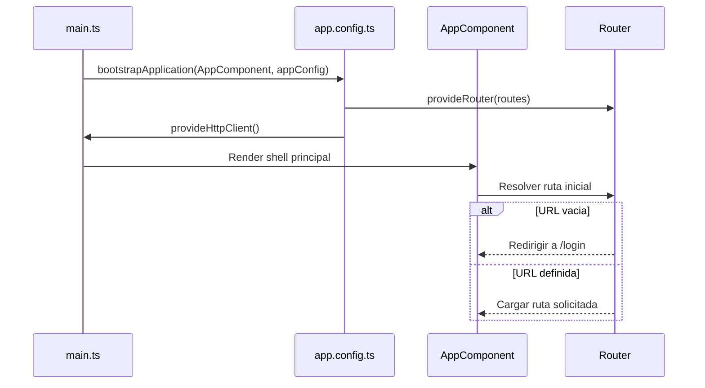
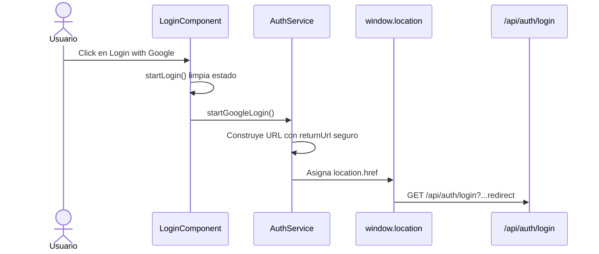
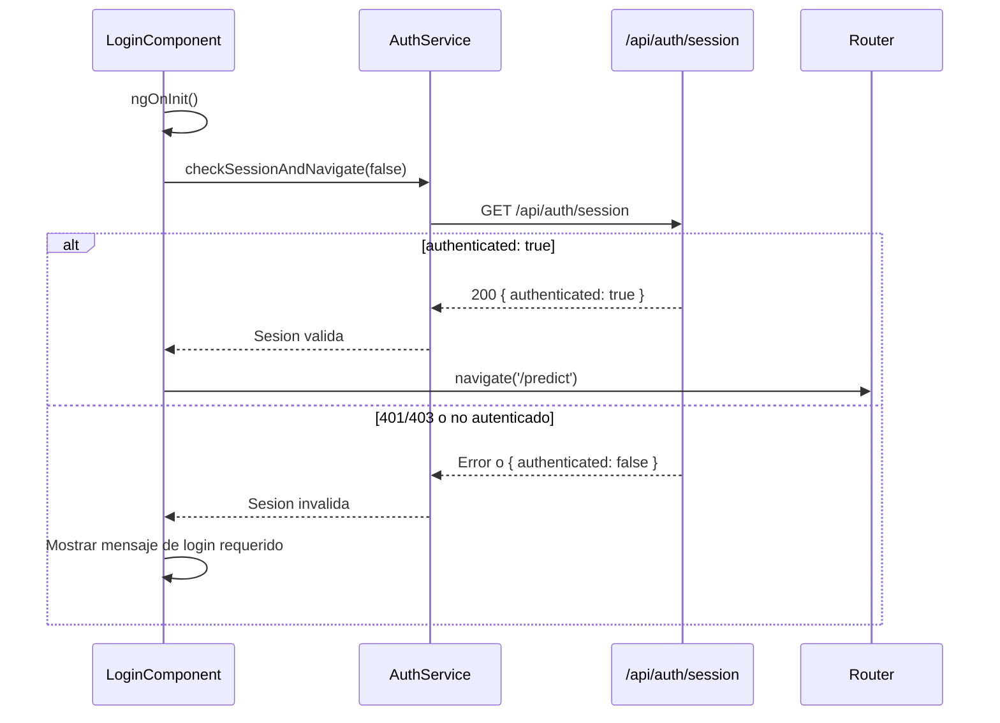
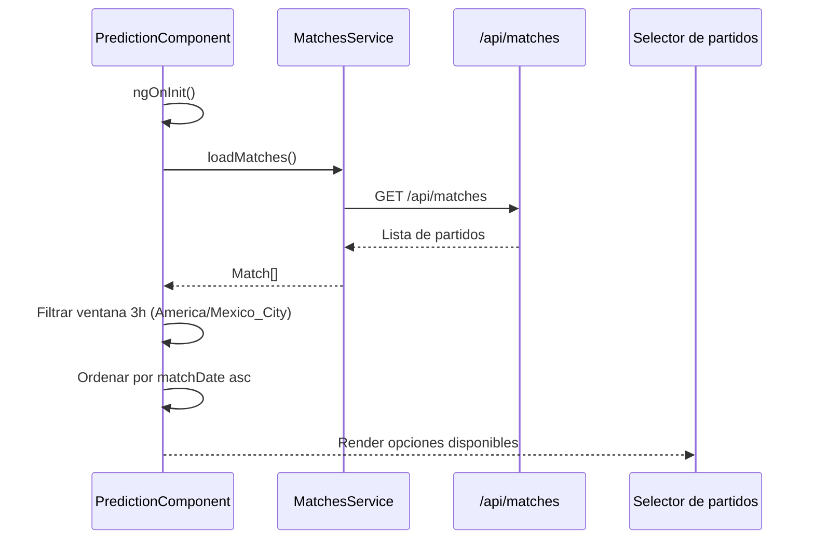
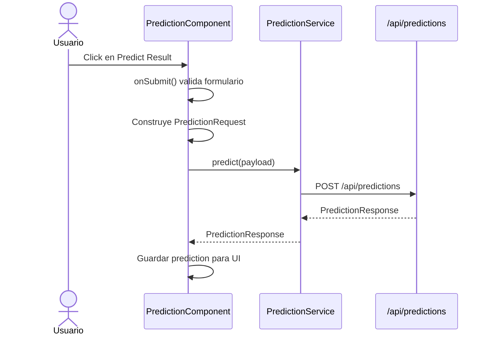
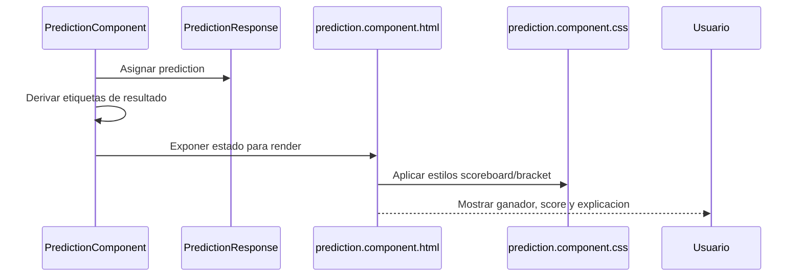
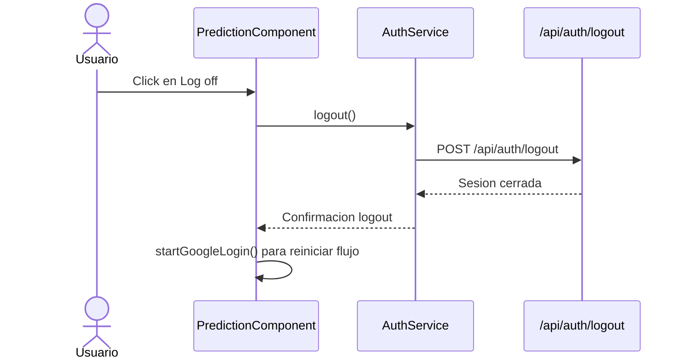
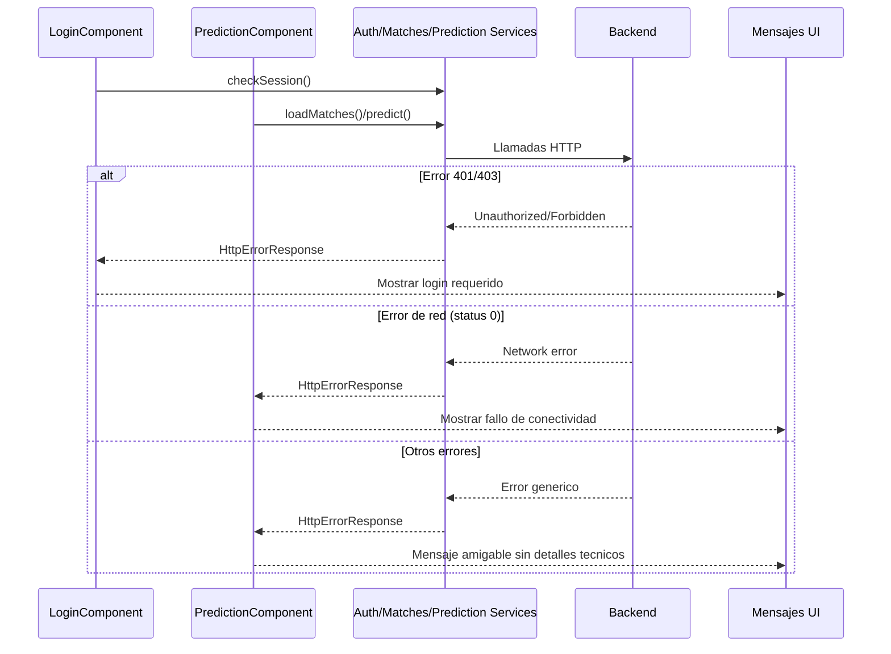
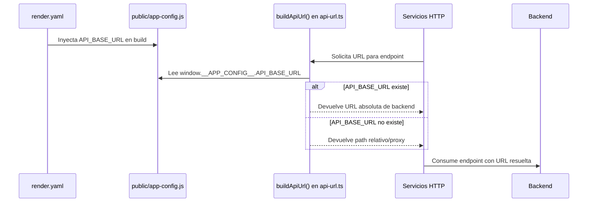

# Arquitectura del proyecto FIFA World Cup Predictor

## 1. Resumen ejecutivo

Este proyecto es un frontend Angular 22 implementado con componentes standalone, rutas simples y una capa de servicios para integrar el flujo de autenticación y predicción con un backend externo. La arquitectura evolucionó desde un MVP inicial hacia una base más robusta: ahora incorpora guard de ruta para proteger /predict, un interceptor de autenticación para centralizar credenciales/manejo de 401-403 y helpers puros para extraer reglas de negocio fuera de los componentes.

## 2. Objetivo funcional del sistema

El sistema soporta tres responsabilidades principales:
1. iniciar y validar una sesión de usuario vía autenticación externa con Google;
2. cargar partidos pendientes y filtrar los que ya tienen un resultado 
3. enviar una solicitud de predicción y renderizar un resultado previsto con una explicación textual.

## 3. Mapa de componentes y responsabilidades

### 3.1 Arranque y shell de la aplicación
- AppComponent: componente raíz.
- main.ts: punto de entrada de Angular; ejecuta bootstrapApplication con appConfig.
- app.config.ts: configura providers globales de Angular, incluyendo router e HttpClient.

### 3.2 Páginas o vistas del producto
- LoginComponent: vista de aterrizaje para autenticación, validación inicial de sesión y redirección a la pantalla de predicción cuando ya está autenticado.
- PredictionComponent: vista principal del producto, responsable de verificar auth, desplegar el selector de partidos, enviar predicciones y presentar resultados.

### 3.3 Servicios de integración y acceso a datos
- AuthService: encapsula el inicio de login con Google, la comprobación de sesión y el logout, usando llamadas HTTP con credenciales para mantener la sesión del backend.
- MatchesService: encapsula la consulta de partidos desde el backend.
- PredictionService: encapsula el envío del payload de predicción al backend.
- buildApiUrl(): helper de infraestructura que resuelve la URL de backend en runtime y en desarrollo local.

### 3.4 Modelos de dominio y contratos de datos
- Match: modelo de entrada con datos del partido: equipos, fase, sede y fecha.
- PredictionRequest: payload enviado al backend con los atributos del partido seleccionado.
- PredictionResponse: contrato de respuesta que representa el resultado predicho, score, resultado, explicación y metadatos opcionales.
- AuthSessionResponse: respuesta de sesión usada por el frontend para validar si el usuario está autenticado.

### 3.5 Infraestructura y configuración operativa
- app.routes.ts: mapeo de rutas del sistema.
- auth.guard.ts: protección declarativa de /predict ante sesiones no válidas.
- auth.interceptor.ts: centraliza withCredentials para /api y manejo transversal de 401/403.
- proxy.conf.json: proxy de desarrollo para redirigir /api a http://localhost:8080.
- public/app-config.js: archivo de configuración cargado en runtime para inyectar API_BASE_URL.
- render.yaml: blueprint de despliegue en Render para producir la app de forma estática y configurar variables de runtime.
- angular.json: configuración de compilación y assets del proyecto.

### 3.6 Helpers de reglas de negocio
- match-filter.helper.ts: filtra y ordena partidos disponibles en ventana temporal, desacoplado de la UI.
- prediction-parser.helper.ts: transforma respuestas de predicción y normaliza mensajes de error.
- team-badge.helper.ts: genera iniciales de equipo para rendering visual.

## 4. Arquitectura funcional por capas

### 4.1 Capa de presentación
Responsable de la experiencia visual y de la interacción del usuario:
- LoginComponent
- PredictionComponent
- templates HTML y estilos CSS asociados

### 4.2 Capa de servicios
Responsable de encapsular integración con el backend y reglas de acceso a recursos:
- AuthService
- MatchesService
- PredictionService

Nota: la responsabilidad de adjuntar credenciales al request ya no está en cada servicio, sino centralizada en AuthInterceptor.

### 4.3 Capa de modelos
Define contratos de datos y tipado para las transacciones entre frontend y backend:
- Match
- PredictionRequest
- PredictionResponse
- AuthSessionResponse

### 4.4 Capa de infraestructura y runtime
Responsable del arranque, routing, configuración de URL y despliegue:
- main.ts
- app.config.ts
- app.routes.ts
- core/guards/auth.guard.ts
- core/interceptors/auth.interceptor.ts
- api-url.ts
- proxy.conf.json
- render.yaml
- public/app-config.js

## 5. Flujos nombrados del sistema

### Flujo 1 — Inicio del shell de la aplicación
Nombre: Arranque del shell Angular
Componentes involucrados:
- main.ts
- AppComponent
- app.config.ts
- app.routes.ts
- Router

Descripción:
1. main.ts invoca bootstrapApplication para arrancar Angular.
2. appConfig registra provideRouter(routes) y provideHttpClient().
3. AppComponent renderiza el RouterOutlet como shell único.
4. El router resuelve la ruta inicial y redirige a /login cuando la URL está vacía.

Diagrama de secuencia:

### Flujo 2 — Inicio de autenticación externa
Nombre: Redirección a Google Login
Componentes involucrados:
- LoginComponent
- AuthService
- window.location
- backend /api/auth/login

Descripción:
1. El usuario pulsa “Login with Google”.
2. LoginComponent.startLogin() limpia el estado local y marca el login como en progreso.
3. LoginComponent obtiene returnUrl desde query params (si existe), lo sanitiza y se lo pasa a AuthService.startGoogleLogin().
4. AuthService.startGoogleLogin() construye la URL del backend con redirect_uri, redirectUrl y returnUrl apuntando a la ruta objetivo segura.
5. El navegador ejecuta una redirección completa al endpoint de login externo.

Diagrama de secuencia:

### Flujo 3 — Verificación de sesión previa
Nombre: Validación de sesión activa en el arranque
Componentes involucrados:
- LoginComponent
- AuthService
- Router
- backend /api/auth/session

Descripción:
1. LoginComponent.ngOnInit() invoca checkSessionAndNavigate(false).
2. AuthService.getSession() realiza GET /api/auth/session; AuthInterceptor adjunta withCredentials para requests /api.
3. Si el backend responde con authenticated: true, el componente navega a /predict.
4. Si el backend retorna 401/403 o no está autenticado, el flujo se mantiene en login y muestra mensaje de login requerido.

Diagrama de secuencia:

### Flujo 4 — Carga del catálogo de partidos
Nombre: Carga y filtrado de partidos disponibles
Componentes involucrados:
- PredictionComponent
- MatchesService
- Match
- backend /api/matches

Descripción:
1. PredictionComponent.ngOnInit() invoca loadMatches() y checkAuthentication().
2. MatchesService.getMatches() consulta /api/matches; AuthInterceptor adjunta withCredentials.
3. PredictionComponent filtra partidos que aún estén disponibles en una ventana de 3 horas desde el kickoff, usando una clave temporal calculada en America/Mexico_City.
4. El listado se ordena cronológicamente para formar el selector.

Diagrama de secuencia:

### Flujo 5 — Envío de la predicción
Nombre: Solicitud de predicción al backend
Componentes involucrados:
- PredictionComponent
- PredictionService
- PredictionRequest
- Match
- backend /api/predictions

Descripción:
1. El usuario selecciona un partido del dropdown y confirma con “Predict Result”.
2. PredictionComponent.onSubmit() valida el formulario y construye el payload con el partido elegido.
3. PredictionService.predict() envía POST /api/predictions y AuthInterceptor centraliza withCredentials.
4. El backend responde con PredictionResponse y el componente lo almacena para renderizar la UI.

Diagrama de secuencia:

### Flujo 6 — Renderizado del resultado previsto
Nombre: Presentación del resultado y explicación
Componentes involucrados:
- PredictionComponent
- PredictionResponse
- prediction.component.html
- prediction.component.css

Descripción:
1. El componente almacena la respuesta de predicción en prediction.
2. Se derivan etiquetas legibles como ganador proyectado, score y resultado humano.
3. El template muestra el scoreboard, el resultado y la explicación del modelo.
4. La vista también incluye una representación visual tipo bracket para reforzar el storytelling del producto.

Diagrama de secuencia:

### Flujo 7 — Cierre de sesión
Nombre: Logout y reinicio del ciclo de autenticación
Componentes involucrados:
- PredictionComponent
- AuthService
- backend /api/auth/logout

Descripción:
1. El usuario pulsa “Log off”.
2. PredictionComponent.logOff() llama a AuthService.logout(); AuthInterceptor adjunta credenciales.
3. El backend procesa el cierre de sesión y el componente reacciona reiniciando el ciclo de autenticación mediante startGoogleLogin().

Diagrama de secuencia:

### Flujo 8 — Manejo de errores transversales
Nombre: Gestión de fallos de red, auth y validación de formulario
Componentes involucrados:
- LoginComponent
- PredictionComponent
- AuthService
- MatchesService
- PredictionService
- HttpErrorResponse

Descripción:
1. LoginComponent transforma errores de session check en mensajes de usuario específicos para 401/403, 0 y otros casos.
2. PredictionComponent convierte errores de predicción y carga de matches en mensajes amigables y estados de UI.
3. El componente centraliza mensajes operativos para no exponer detalles técnicos del backend.

Diagrama de secuencia:

### Flujo 9 — Configuración dinámica de runtime para producción
Nombre: Resolución de URL de backend en runtime
Componentes involucrados:
- api-url.ts
- public/app-config.js
- render.yaml
- angular.json

Descripción:
1. buildApiUrl() lee window.__APP_CONFIG__.API_BASE_URL si existe.
2. Si no existe, la implementación cae al path relativo para desarrollo local o al proxy.
3. Render inyecta la variable API_BASE_URL durante el build de producción para construir URLs correctas del backend.

Diagrama de secuencia:

## 6. Decisiones arquitectónicas clave

### 6.1 Arquitectura por componentes standalone
Decisión: usar componentes standalone para reducir boilerplate y simplificar la creación de vistas.

Ventajas:
- arranque rápido del proyecto;
- menos configuración repetida que con NgModules;
- fit natural para un MVP de una sola feature.

Riesgos:
- el sistema podría crecer en complejidad sin un criterio claro de organización y composición;
- el acoplamiento entre componente y lógica de UI puede crecer.

### 6.2 Separación de responsabilidades en servicios inyectables
Decisión: encapsular llamadas HTTP en AuthService, MatchesService y PredictionService.

Ventajas:
- desacopla la vista de la integración con el backend;
- facilita cambios de contrato o endpoint;
- deja al componente enfocado en interacción y render.

Riesgos:
- se mantiene lógica de negocio ligera en el componente;
- no existe aún una capa de use cases o state management explícito.

### 6.3 Routing protegido con guard de autenticación
Decisión: mantener rutas explícitas para /login y /predict, agregando auth guard en /predict y redirecciones generales al login.

Ventajas:
- navegación fácil de entender;
- bajo costo de implementación;
- compatible con un producto orientado a una experiencia lineal.

Riesgos:
- se requiere evitar bucles de redirección cuando falla sesión durante navegación;
- la experiencia de usuario debe balancear seguridad (fail-closed) y mensajes claros de login.

### 6.4 Autenticación basada en cookies con interceptor centralizado
Decisión: usar AuthInterceptor para adjuntar withCredentials en llamadas /api y centralizar manejo de 401/403.

Ventajas:
- coincide con la estrategia del backend para sesiones de navegador;
- elimina duplicación de configuración HTTP en cada servicio;
- unifica el comportamiento frente a expiración de sesión.

Riesgos:
- implica mayor sensibilidad a CORS, SameSite y política de cookies del navegador;
- cualquier cambio en la política de cookies puede romper todo el flujo;
- requiere pruebas específicas para asegurar que no afecte llamadas no API.

### 6.5 Estado local y reactividad con helpers puros
Decisión: mantener estado de formulario, loading, mensaje de error y resultado en componentes, pero extraer reglas de negocio y transformaciones a helpers reutilizables.

Ventajas:
- reduce complejidad de componentes;
- facilita pruebas unitarias aisladas de lógica de negocio;
- mejora reutilización y mantenimiento.

Riesgos:
- se debe mantener la frontera clara entre lógica de presentación y negocio para evitar duplicación futura.

### 6.6 Configuración dinámica de base URL para entornos
Decisión: usar buildApiUrl() plus public/app-config.js para ajustar la URL del backend según el entorno.

Ventajas:
- favorece despliegues en local y en producción sin tocar el código fuente;
- reduce el acoplamiento con un host estático.

Riesgos:
- la estrategia depende de que la variable runtime exista en el proceso de build;
- la resolución se hace de forma manual y no se centraliza en un interceptor HTTP.

## 7. Puntos fuertes del diseño actual

- Separación clara entre pantallas y servicios HTTP.
- Flujo de usuario lineal y comprensible.
- Integración con backend vía servicios bien delimitados.
- Soporte para desarrollo local con proxy y runtime config para producción.
- Protección declarativa de /predict con guard y manejo transversal de auth con interceptor.
- Reglas de negocio críticas de predicción desacopladas en helpers puros.
- Cobertura de pruebas en crecimiento con unit tests e integración inicial para navegación protegida y expiración de sesión.
- Cobertura de integración de UI para expiración de sesión en predicción (estado requiresLogin + enlace a login en 401/403).
- Cobertura de integración para flujo de logout en predicción, incluyendo estado isLoggingOut, prevención de doble envío y reinicio de ciclo de autenticación en éxito/error.
- Cobertura de integración encadenada del flujo auth completo en frontend: acceso bloqueado por guard, recuperación por returnUrl tras login y retorno a login por expiración de sesión (401) vía interceptor.

## 8. Debilidades y riesgos arquitectónicos

- Aún falta ampliar cobertura de pruebas en flujos críticos completos de autenticación/predicción.
- El manejo de errores está disperso y depende de condiciones manuales en cada pantalla.
- No existe aún suite de pruebas end-to-end para validar el recorrido completo navegador-login-backend.
- El estado del formulario y del resultado puede crecer de forma poco mantenible si se agregan varias pantallas o flujos concurrentes.

## 9. Recomendaciones de evolución arquitectónica

1. Completar y mantener una suite de pruebas unitarias para auth.guard, auth.interceptor y helpers puros, con cobertura de casos de error.
2. Extender las pruebas de integración existentes para cubrir login, sesión, matches y prediction de extremo a extremo dentro del frontend, validando redirecciones, expiración de sesión y feedback de UI asociado en más variantes de ruta/estado.
3. Definir un store o servicio de estado compartido si la app crece su complejidad.
4. Formalizar el contrato del backend mediante interfaces o schemas compartidos.
5. Evaluar unificar aún más el manejo de mensajes UI de autenticación para reducir lógica condicional repetida en componentes.

## 10. Conclusión

La arquitectura actual mantiene la simplicidad del MVP, pero ya incorpora pilares de hardening en frontend: guard de ruta, interceptor de autenticación y separación de reglas de negocio en helpers puros. El siguiente salto de madurez se centra en cobertura de pruebas (unitarias e integración), evolución del estado compartido y formalización de contratos para escalar con menor riesgo.
