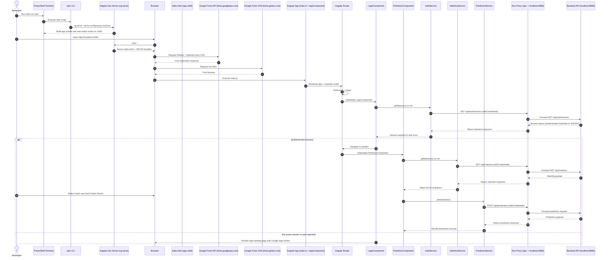

# FifaWorldCupPredictor

This project was generated using [Angular CLI](https://github.com/angular/angular-cli) version 22.0.3.

## Development server

To start a local development server, run:

```bash
ng serve
# or
npm run start
```

Once the server is running, open your browser and navigate to `http://localhost:4200/`. 
The application will automatically reload whenever you modify any of the source files.

## Backend API requirements

This frontend now relies on backend endpoints for both auth and data. During local development, `proxy.conf.json` forwards `/api/*` calls to `http://localhost:8080`.

Required endpoints:

- `GET /api/auth/session` (with credentials) to validate login status.
- `GET /api/matches` (with credentials) to load the match selector dropdown.
- `POST /api/predictions` (with credentials) to request a prediction.

The `GET /api/matches` response must be a top-level JSON array with this shape per item:

```json
[
	{
		"homeTeam": "Mexico",
		"awayTeam": "South Africa",
		"matchStage": "Group A",
		"venue": "Estadio Ciudad de Mexico",
		"matchDate": "2026-06-11T13:00:00-06:00"
	}
]
```

## Architecture Sequence: Server Start to Prediction Flow

The diagram below describes the runtime sequence from local server startup through login/session validation, match loading from backend, and prediction submission.



## Code scaffolding

Angular CLI includes powerful code scaffolding tools. To generate a new component, run:

```bash
ng generate component component-name
```

For a complete list of available schematics (such as `components`, `directives`, or `pipes`), run:

```bash
ng generate --help
```

## Building

To build the project run:

```bash
ng build
```

This will compile your project and store the build artifacts in the `dist/` directory. By default, the production build optimizes your application for performance and speed.

## Deploy To Render (Exact Steps)

This project is configured to read backend base URL from `public/app-config.js` at runtime.

### Render Blueprint (recommended)

This repository now includes a Render Blueprint file: `render.yaml`.

1. In Render, choose `New` -> `Blueprint`.
2. Connect this repository.
3. When prompted for environment variables, set:
	- `API_BASE_URL` = your backend URL (example: `https://your-backend.onrender.com`)
4. Deploy.

The blueprint already configures:

- Static site build command with runtime `app-config.js` injection.
- Publish directory `dist/fifa-world-cup-predictor/browser`.
- SPA rewrite rule (`/*` -> `/index.html`) for Angular routes.

### 1) Deploy backend first (Render Web Service)

1. Create a Render `Web Service` for your backend repository.
2. Deploy and copy the backend public URL, for example:
	- `https://your-backend.onrender.com`
3. Ensure backend CORS/cookie settings allow your frontend origin:
	- `Access-Control-Allow-Origin` = your Render frontend URL
	- `Access-Control-Allow-Credentials` = `true`
	- Session cookie supports cross-site usage when needed (`Secure`, `SameSite=None`).

### 2) Deploy frontend (Render Static Site)

1. Create a Render `Static Site` for this repository.
2. Set environment variable in Render static site:
	- Key: `API_BASE_URL`
	- Value: your backend URL (for example `https://your-backend.onrender.com`)
3. Configure build settings exactly:
	- Build Command:

```bash
npm ci && echo "window.__APP_CONFIG__={API_BASE_URL:'$API_BASE_URL'};" > public/app-config.js && npm run build
```

	- Publish Directory:

```bash
dist/fifa-world-cup-predictor/browser
```

4. Deploy.

### 3) Verify after deploy

1. Open frontend Render URL.
2. Click login and confirm Google flow returns to `/login` then routes to `/predict`.
3. Confirm match dropdown loads from backend.
4. Run prediction and verify response from backend.
5. Click `Log off` and verify session closes and login flow restarts.

### Notes

- Local development remains unchanged with `npm run start` and `proxy.conf.json`.
- In production, all API calls use `API_BASE_URL` injected into `public/app-config.js` during Render build.

## Running unit tests

To execute unit tests with the [Vitest](https://vitest.dev/) test runner, use the following command:

```bash
ng test
```

## Running end-to-end tests

For end-to-end (e2e) testing, run:

```bash
ng e2e
```

Angular CLI does not come with an end-to-end testing framework by default. You can choose one that suits your needs.

## Additional Resources

For more information on using the Angular CLI, including detailed command references, visit the [Angular CLI Overview and Command Reference](https://angular.dev/tools/cli) page.
